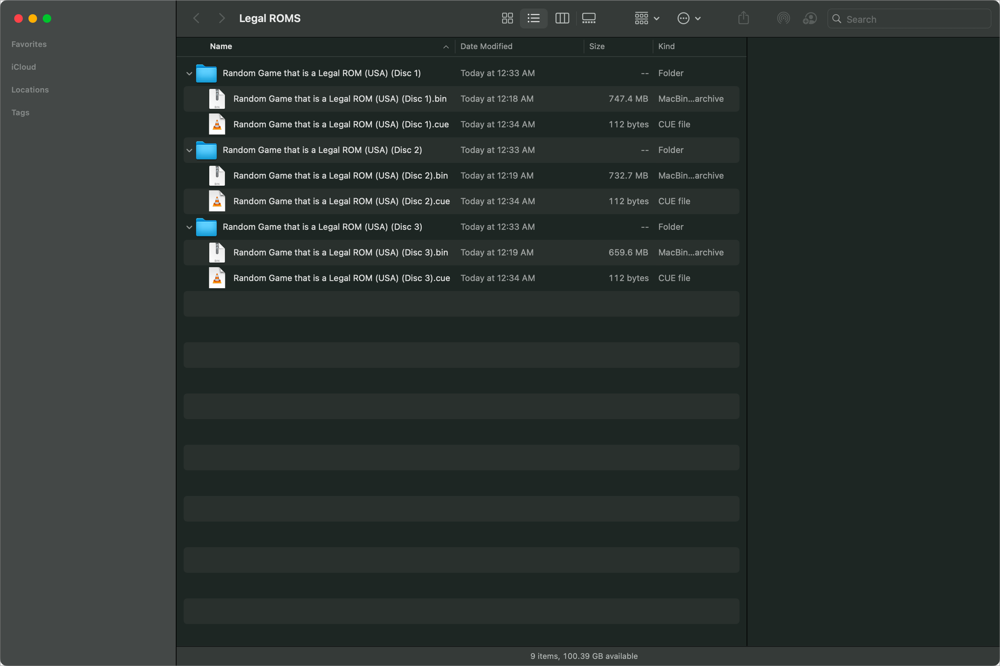
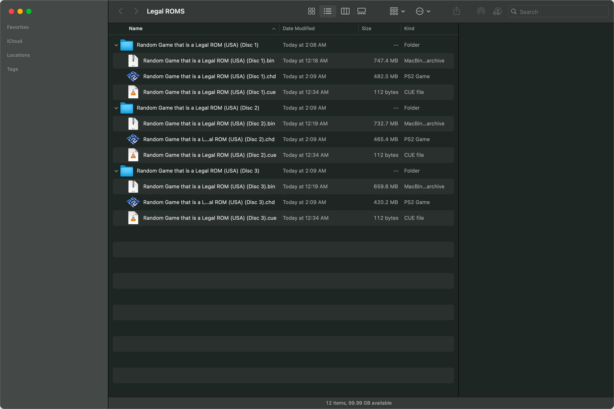
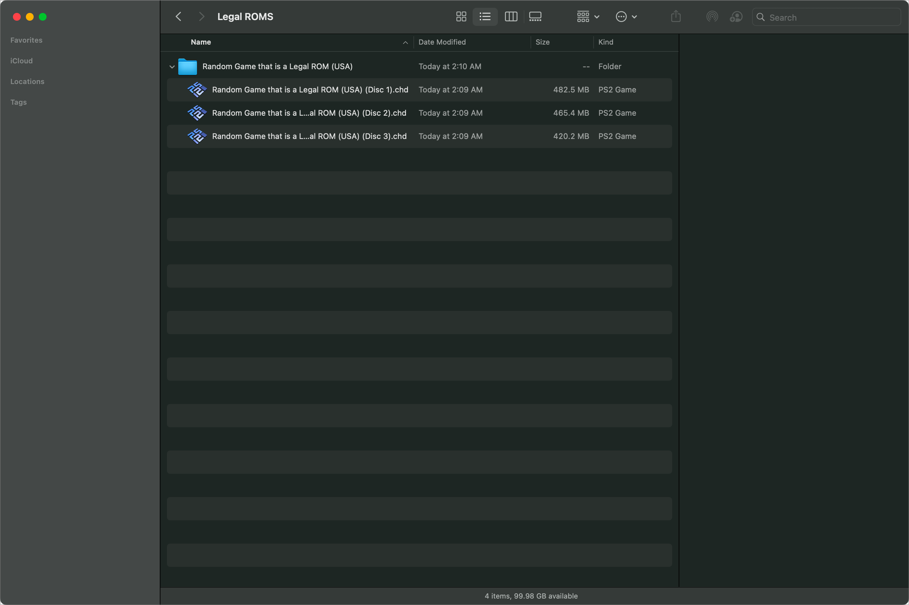
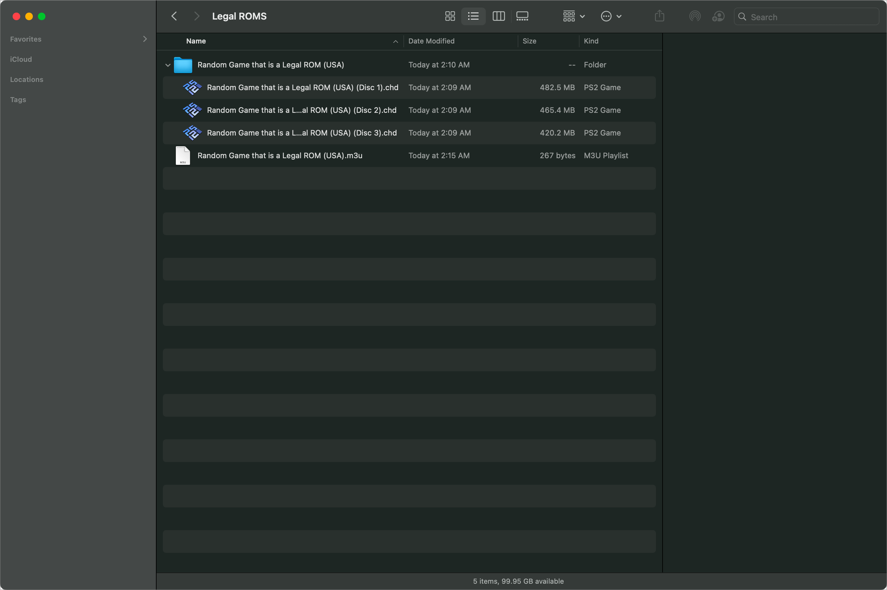
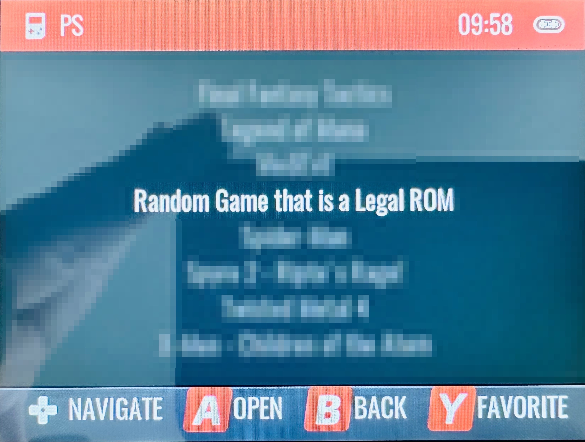

# Add multi-disc games to Garlic OS on your Anbernic RG35XX using macOS

A member of the PlayStation homebrew community has developed a game for users of PSX emulators to enjoy, released under a permissive software license which allows sharing and re-use. After downloading the completely legal ROM of the game, you notice that the game is provided as multiple discs (folders), each containing a `*.bin` and `*.cue` file.

This will help you load all of the discs into your emulator, but have a _single entry_ in the game listing.

Each step is explained in English with the corresponding terminal command below it. These instructions should work without problem on any modern macOS — with either Intel or Apple Silicon CPUs. Tested on macOS Ventura 13.5 on both an Intel i9 chip, and an Apple M1 Max chip.

## Prerequisites

* A _relatively_ [recent version of macOS](https://gist.github.com/skyzyx/225b59847be31b39d3d19c3a1c006862).

    <div></div>

* Comfortable-enough using _Terminal.app_ (or alternatives).

    <div></div>

* An application which can open `.7z` archives. I can recommend:

    * [The Unarchiver](https://apps.apple.com/us/app/the-unarchiver/id425424353?mt=12) (free)
    * [Archiver](https://archiverapp.com) (paid)

* You have [Homebrew](https://brew.sh) installed. ([Installation](https://mac.install.guide/homebrew/index.html) is outside the scope of this tutorial, but it’s pretty fundamental if you do technical things on your Mac.)

    * This includes installing the [Xcode CLI tools](https://mac.install.guide/homebrew/2.html) (a much smaller download than the _entire_ Xcode).

## Decompressing the file

1. After downloading the game from the homebrew developer's website, you find that the game is compressed as a `.7z` file.

1. Decompress the `.7z` file.

    1. Select the file(s).

    1. _Right-click_ with a mouse; _two-finger tap_ on a trackpad; or _control-click_ with the keyboard — and then choose _Open_ from the menu.

        (Or if you prefer the keyboard, type _command-down_ (`⌘ ↓`) to open files.)

    1. When you are done, you should have multiple folders containing multiple `.bin`/`.cue` pairs.

        

## Convert each `.bin`/`.cue` pair to a single `.chd` file

1. Follow the instructions in “[Converting your completely legal, disc-based, bin/cue ROMs for PlayStation emulation into compressed, single-file CHDs using macOS](bin-cue-chd.en_us.md)”

1. When that's done, each folder will have a `.bin`, `.cue`, and `.chd` file.

    

1. Move all of the `.chd` files into the same folder, then cleanup the original folders and `.bin`/`.cue` pairs.

    

## Create an `.m3u` playlist file

1. Install `coreutils` and `findutils` using Homebrew.

    > **NOTE:** `findutils` may already be installed if you converted the files to `.chd` format.

    ```bash
    brew install coreutils findutils
    ```

1. In Terminal, move to the directory which _contains_ the directory, which contains your `.chd` files. In other words, move to the _grandparent_ directory of your `.chd` files. In the screenshots above, this is the _Legal ROMs_ directory.

1. From that _grandparent_ directory (e.g., _Legal ROMs_), we will use `gfind` to look inside the _parent_ directory (e.g., _Random Game that is a Legal ROM (USA)_), find all of the `.chd` files inside that directory, then use `gtee` to write to write a new `.m3u` file in the _grandparent_ directory.

    ```bash
    gfind "Random Game that is a Legal ROM (USA)" -type f -name "*.chd" \
        | gtee "Random Game that is a Legal ROM (USA).m3u"
    ```

1. When that's done, you should confirm that your directory structure has the `.m3u` file as a _sibling_ (i.e., at the same level) of the folder which contains the `.chd` files.

    

1. Verify the contents of the `.m3u` file. You can easily do this with _QuickLook_.

    * There should be one line per disc.

    * Each line should start with the folder name, then `/`, then the `.chd` filename.

    ```plain
    Random Game that is a Legal ROM (USA)/Random Game that is a Legal ROM (USA) (Disc 1).chd
    Random Game that is a Legal ROM (USA)/Random Game that is a Legal ROM (USA) (Disc 2).chd
    Random Game that is a Legal ROM (USA)/Random Game that is a Legal ROM (USA) (Disc 3).chd
    ```

    

## Load the game onto your emulation device



> **NOTE:** If someone knows how to take a screenshot in Garlic OS (and not RetroArch), please open an issue to let me know. Thanks!
